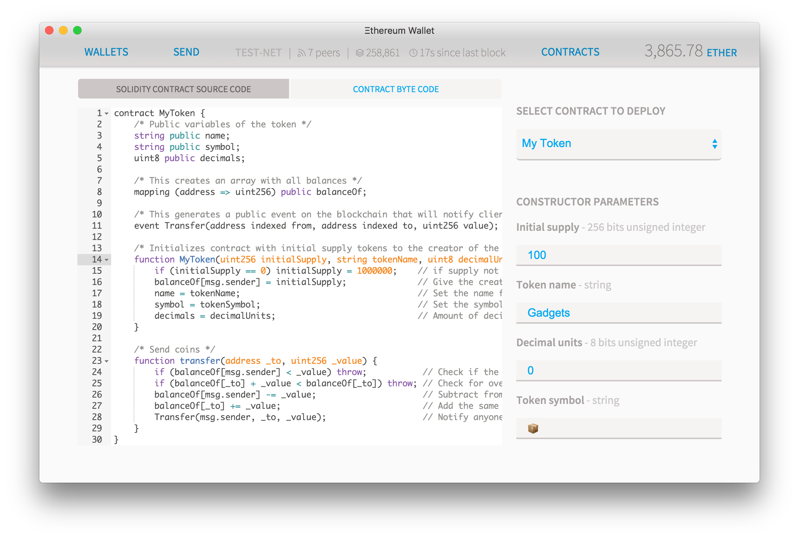
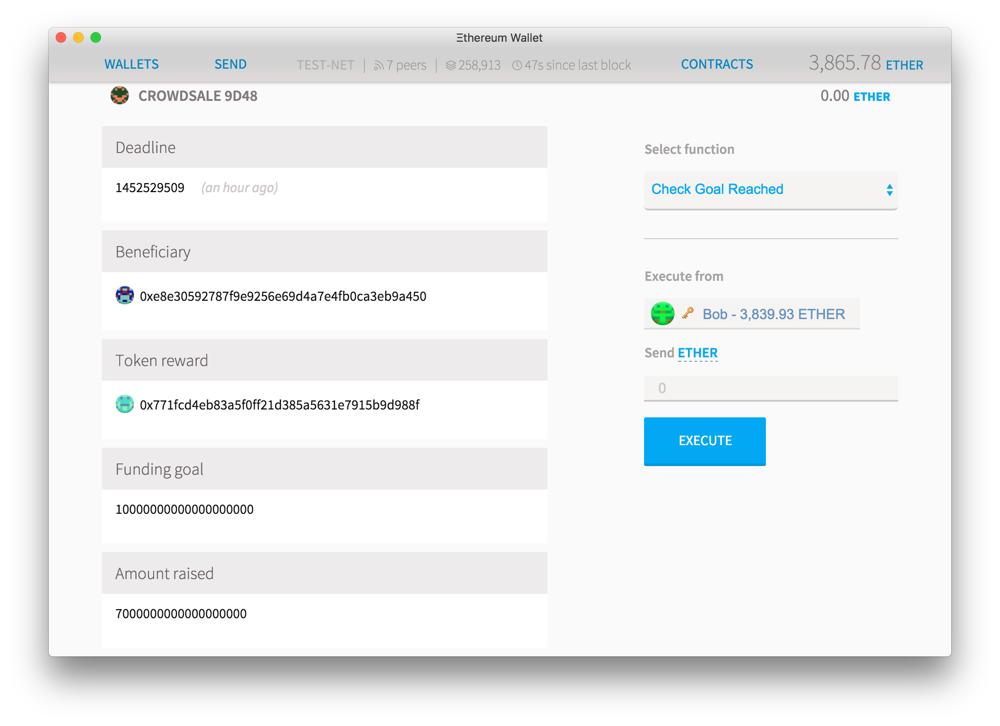

# 众筹

## 众筹你的想法

有时候一个好主意需要花费大量的资金和集体努力。
你可以要求捐款，但捐助者更愿意捐赠给他们更确定的项目，将获得牵引力和适当的资金。
众筹是理想的例子：你设定了一个目标并达成目标的最后期限。
如果你错过了你的目标，那么捐款将被退回，从而降低捐献者的风险。
由于代码是开放和可审计的，因此不需要集中的可信平台，因此每个人只需支付的费用仅仅是天然气费用。

### 令牌和DAOs

在这个例子中，我们将通过解决两个重要问题来进行更好的众筹：如何管理和维护奖励以及在筹集资金之后如何花费金钱。

奖励活动中的奖励通常由中央不可更改的数据库处理，该数据库跟踪所有捐助者：错过活动截止日期的任何人都无法再进入，任何改变主意的捐助者都无法离开。
相反，我们将以分散化的方式完成此任务，并创建一个[token] [1]来跟踪奖励，任何贡献的人都会获得一个令牌，以便他们可以交易，出售或稍后保留。
当需要给予物质奖励的时候，生产者只需要交换实际产品的代币。
作为纪念品，捐助者可以保留自己的代币，即使项目没有实现其目标。

另外，一般来说，资金支持者在资金筹集后如何花费金钱方面无法发言，而管理不善常常导致项目永远无法提供任何东西。
在这个项目中，我们将使用一个[民主组织] [2]，它必须批准从系统中出来的任何资金。
这通常被称为** crowdsale **或**众筹**，并且非常基本，在某些情况下，令牌可以成为奖励本身，特别是在一群人聚集在一起以建立共同公共物品的项目中。



* 如果你只是测试，将钱包切换到测试网并开始挖掘。

* 首先，创建一个[固定供应令牌] [3]。对于这个例子，我们将创建** 100 **的供应，使用名称** gadgets **，框表情符号（📦）作为符号和** 0 **小数位。部署它并保存地址。

* 现在创建一个[股东协会] [4]。在这个例子中，我们将使用我们刚刚创建的令牌地址作为**股份地址**，** 10 **的最低法定人数，以及** 1500 **分钟（25小时）作为投票时间,。部署此合同并保存地址。

### 代码

现在复制这段代码，让我们创建crowdsale：

```js
!!!include(solidity/crowdsale.sol)!!!
{!../../solidity/crowdsale.sol!}
```

### 代码亮点

请注意，在** Crowdsale **函数（即创建合同时调用的函数）中，如何设置变量**截止日期**和** fundingGoal **：

    fundingGoal = fundingGoalInEthers * 1 ether;
    deadline = now + durationInMinutes * 1 minutes;
    price = etherCostOfEachToken * 1 ether;

这些是一些[特殊关键词] [5]，可帮助你编码，让你评估一些事情，如** 1 ether == 1000 finney **或** 2 days == 48 hours **。
在系统内部，所有以太量都保持在** wei **中，这是乙醚的最小可分解单位。
上面的代码将资金目标乘以1,000,000,000,000,000,000（这是特殊关键字** ether **转换成的值）将其转化为wei。
下一行创建一个时间戳，与今天完全相距X分钟，同时使用特殊关键字** now **和** minutes **的组合。
对于更多全局关键字，请查看[关于全局可用变量的可靠性文档] [5]。

以下行将在给定地址实例化合同：

    tokenReward = token(addressOfTokenUsedAsReward);

注意合同理解* token *是什么，因为我们之前通过以下方式启动代码来定义它：

    interface token { function transfer(address receiver, uint amount){  } }

这并没有完全描述契约是如何工作的或者它具有的所有功能，而只描述了这个契约需要的契约：一个契约是一个具有* transfer *功能的契约，我们在这个地址有一个契约。

### 我们如何

转到**合同**然后**部署合同**：


* 把刚刚创建的组织的地址放在字段**中，如果成功，发送给**。

* 把** 250 **醚作为资金目标

* 如果你只是做一个测试或示范，那么把众包期限设为3-10分钟，但如果你真的在筹集资金，你可以投入更多的钱，比如** 45,000 **（31天）。

* 如果你只是做一个测试或示范，那么把众包期限设为3-10分钟，但如果你真的在筹集资金，你可以投入更多的钱，比如** 45,000 **（31天）。在这个例子中，放5个醚。

* 您创建的令牌地址应添加到**令牌奖励地址**

输入天然气价格，点击部署，然后等待你的Crowdsale被创建。
一旦创建了众包页面，您现在需要存入足够的奖励，以便支付奖励。
点击众包的地址，然后存入并发送** 50个小配件**到众包。

**我有100个小工具。为什么不全部卖掉？**

这是非常重要的一点。
我们正在建设的众包将由代币持有者完全控制。
这会造成控制所有代币的50％+ 1的人将能够将所有资金发送给自己的危险。
您可以尝试在关联合同上创建特殊代码以防止这些恶意收购，或者您可以将所有资金都发送到简单地址。
为了简化，我们只是简单地出售所有小工具中的一半：如果您想进一步分散这一部分，请将可信组织的剩余部分分开。

### 筹集资金

一旦众包拥有所有必要的令牌，为此做出贡献很简单，您可以从任何以太坊钱包中完成：只需向它发送资金即可。
你可以在这里看到相关的代码：

    function () {
        require(!crowdsaleClosed);
        uint amount = msg.value;
        // ...

[unnamed function] [6]是合同收到乙醚时执行的默认功能。
此功能将自动检查众包是否处于活动状态，计算主叫方购买多少令牌并发送相应的令牌。
如果众包已经结束或者合约没有标记，合约将会抛出**意味着执行将被停止，并且以太传送将被返回（但是所有的气体将被消耗）。


这有一个优点，即合同可以防止陷入某个人没有乙醚或代币的情况下。
在此合同的前一版本中，我们也会在众包结束之后[**自毁**] [7]合同：这意味着在此之后发送的任何交易都将失去其资金。
通过在销售结束时创建一个后备功能，我们可以防止任何人赔钱。

该合同具有safeWithdrawl（）函数，没有任何参数，受益人可以执行该函数以访问募集的金额或资助者在筹款失败的情况下获取资金。



## 扩大众包

### 如果众包超过它的目标呢？

在我们的代码中，只有两件事情可能发生：无论是众包达到目标还是没有。
由于令牌数量有限，这意味着一旦达到目标，其他人无法做出贡献。
但是众筹的历史充满了超出预期的超出目标时间的项目，或者超过了预期数量的许多倍。

### 无限的众包

因此，我们稍微修改我们的项目，以便在有人发送一些令牌时，项目实际上会创建一个新的令牌。
首先，我们需要创建一个[Mintable token] [8]。

然后修改crowdsale以将所有提及的**转移重新命名为** mintToken **：

    contract token { function mintToken(address receiver, uint amount){  } }
    // ...
        function () {
            // ...
            tokenReward.mintToken(msg.sender, amount / price);
            // ...
        }

一旦您发布了众包协议，获取其地址并进入您的**令牌合同**执行**更改所有权**功能。
这将允许您的众包尽可能多地调用** Mint Token **功能。

**警告:**  这会让你面临敌意收购的危险。在众包期间的任何时候，任何捐赠超过已募集的金额的人都将能够控制整个馅饼并偷取它。有许多策略可以防止这种情况发生，但实施将作为练习留给读者：

* 修改众包，这样当一个令牌被购买时，也将相同数量的令牌发送给创始人的账户，以便他们始终控制50％的项目
* 修改组织，以便为可能阻止任何敌意提案的可信第三方制定否决权
* 修改令牌以允许中央信任方冻结令牌帐户，以便要求验证没有任何单个实体控制它们中的大多数

[1]: ./token
[2]: ./dao
[3]: ./token#the-code
[4]: ./dao#the-shareholder-association
[5]: https://solidity.readthedocs.io/en/latest/units-and-global-variables.html
[6]: https://solidity.readthedocs.io/en/latest/contracts.html#fallback-function
[7]: https://solidity.readthedocs.io/en/latest/units-and-global-variables.html#contract-related
[8]: ./token#central-mint