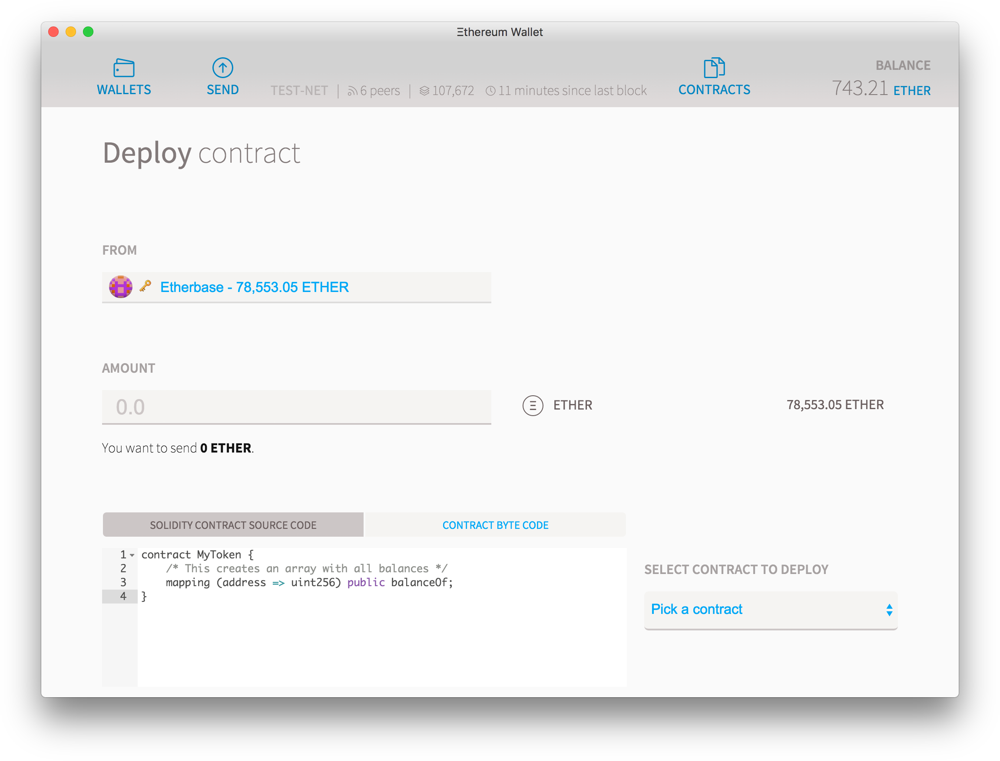
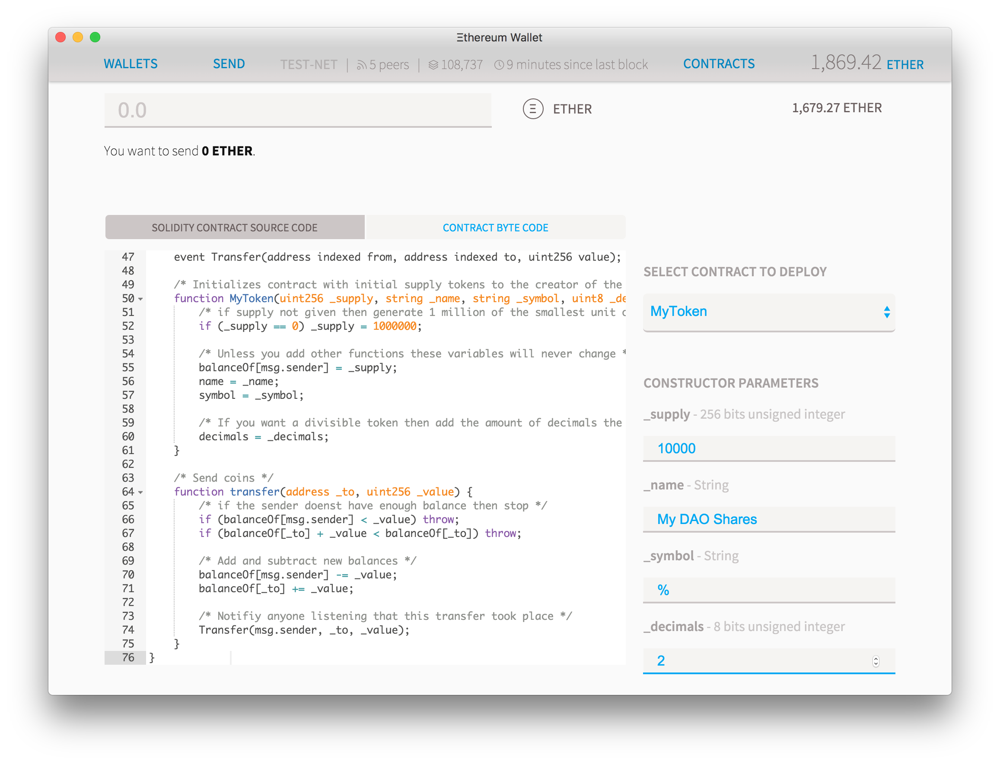
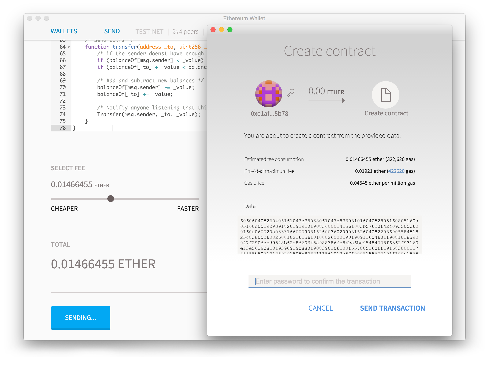
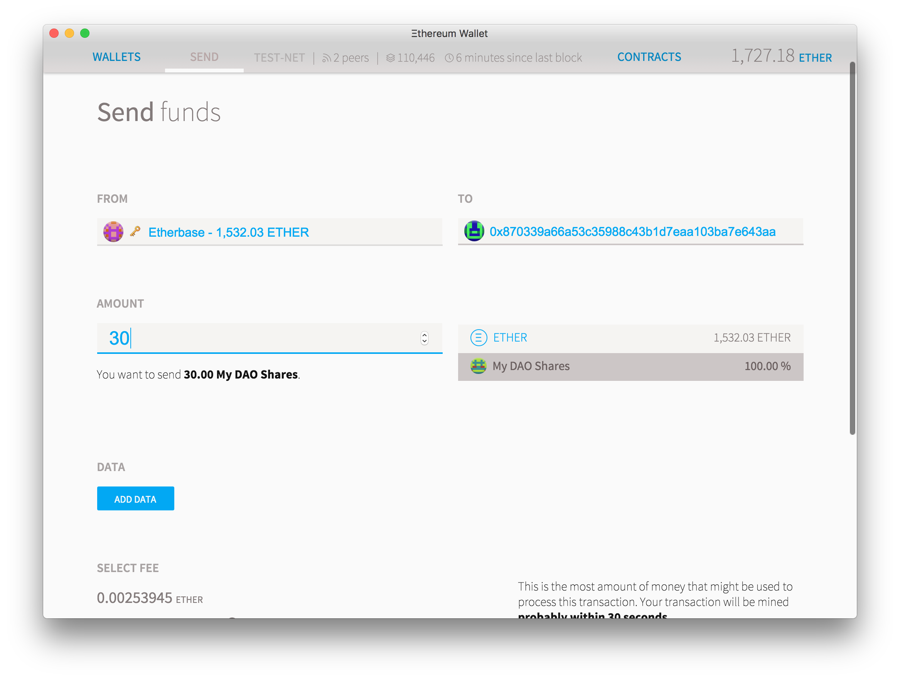
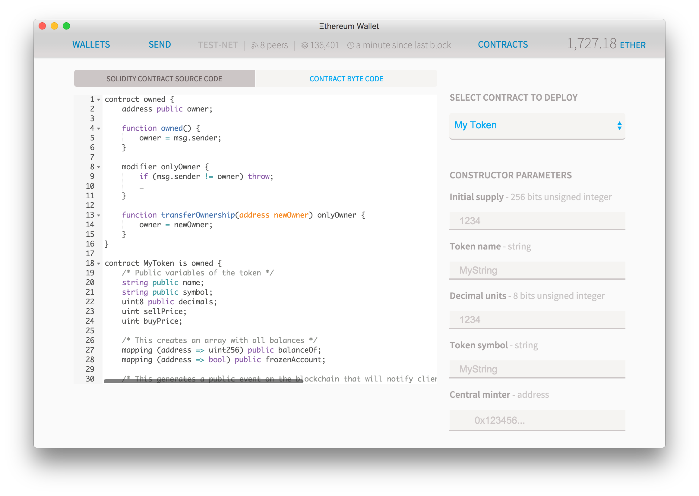
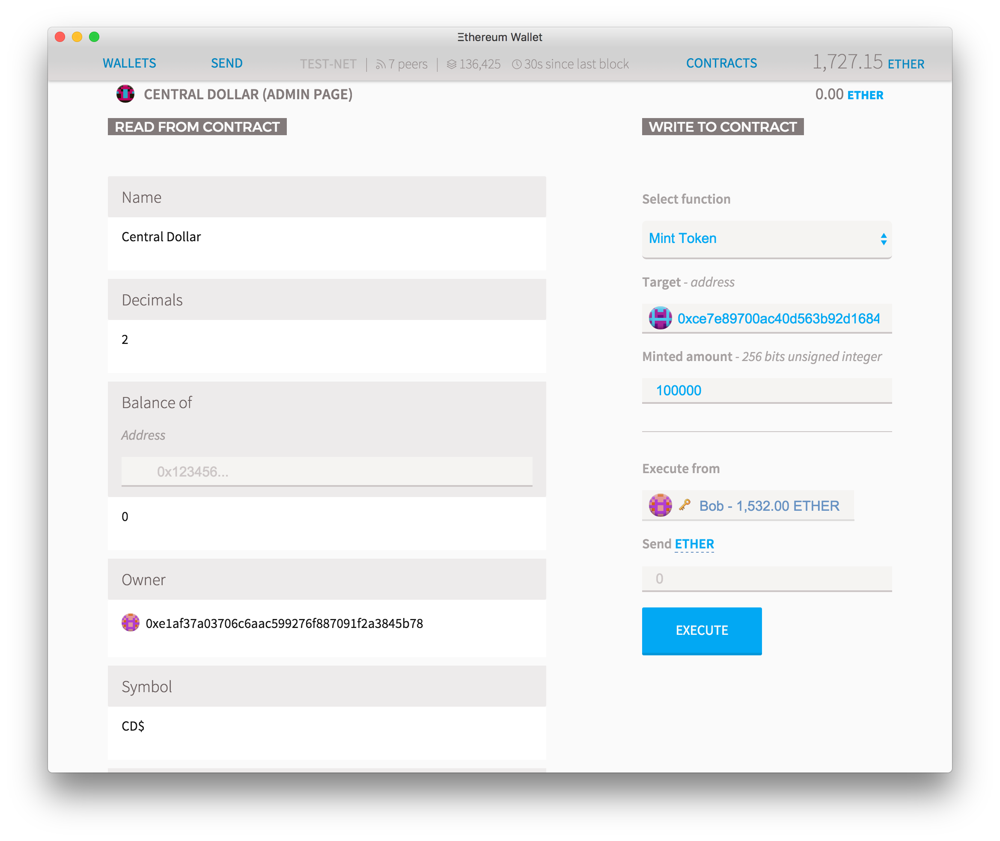
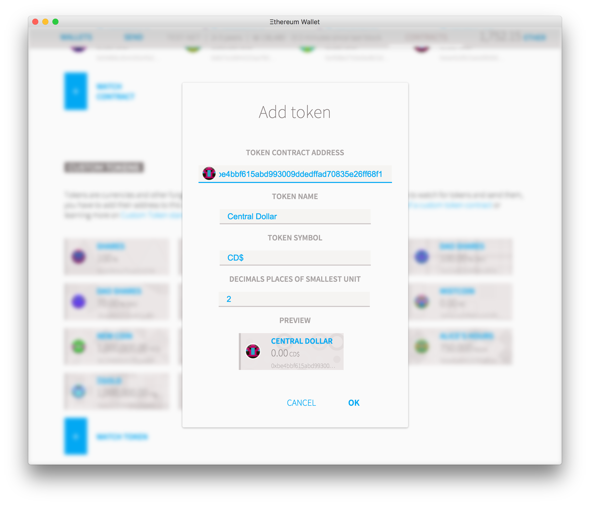

# 发行代币

## 币

我们将创建一个数字令牌。
以太坊生态系统中的代币可以代表任何可替换的可交易商品：硬币，忠诚点，金币，白条，游戏内物品等。
由于所有标记都以标准方式实现了一些基本功能，这也意味着您的标记将立即生效

### 最小可用令牌

标准令牌合约可能相当复杂。
但实质上，一个非常基本的令牌归结为：

```js
!!!include(solidity/token-minimal.sol)!!!
{!../../solidity/token-minimal.sol!}
```

### 代码

但是如果你只想复制粘贴更完整的代码，那么使用下面的代码：

```js
!!!include(solidity/token-erc20.sol)!!!
{!../../solidity/token-erc20.sol!}
```

### 了解代码


所以让我们从基础开始
打开电子钱包应用程序，转到合约选项卡，然后部署新合约。
在Solidity Contract源代码文本字段中，输入以下代码：

```js
    contract MyToken {
        /* 这将创建一个包含所有余额的数组 */
        mapping (address => uint256) public balanceOf;
    }
```

映射意味着一个关联数组，您将地址与余额相关联。
地址是基本的十六进制以太坊格式，余额是整数，范围从0到115 quattuorvigintillion。
如果你不知道quutuorvigintillion是多少，它比许多你打算使用你的代币更令人兴奋。
public*关键字, 意味着这个变量将被区块链上的任何人访问， 意味着所有的余额都是公开的(因为他们需要，为了让客户展示他们).



如果您立即发布您的合约， 它会起作用但不会非常有用： 这将是一个合约，可以查询您的硬币余额的任何地址 - 但因为你从来没有创建一个硬币， 他们中的每一个都会返回0。
所以我们将在启动时创建一些令牌。
在最后一个右括号之前添加此代码，位于*mapping ..*行下方。

```js
    function MyToken() {
        balanceOf[msg.sender] = 21000000;
    }
```

请注意，*函数MyToken *与* contract MyToken *具有相同的名称。
这非常重要，如果你重命名一个， 你必须重新命名另一个： 这是一个特殊的启动功能，仅在合约首次上传到网络时才运行一次。
该功能将设置* msg.sender *的平衡， 部署合约的用户，余额为2100万。

2,100万的选择是相当随意的， 你可以在代码中将其更改为任何你想要的东西， 但有一个更好的方法： 而是将其作为函数的参数提供，如下所示：

```js
    function MyToken(uint256 initialSupply) public {
        balanceOf[msg.sender] = initialSupply;
    }
```

看看合约旁边的右栏，你会看到一个下拉列表，写*pick a contract*。
选择`MyToken`合约，你会看到现在它显示了一个名为* Constructor parameters *的部分。
这些是令牌的可变参数，因此您可以重复使用相同的代码，并且将来只能更改这些变量。


现在你有一个创建令牌余额的功能合约，但由于没有任何功能来移动它，它所做的只是保留在同一个帐户上。
所以我们现在要实施。
在最后一个括号之前写下以下代码。

```js
    /* 发送硬币 */
    function transfer(address _to, uint256 _value) {
        /* 加减新的余额 */
        balanceOf[msg.sender] -= _value;
        balanceOf[_to] += _value;
    }
```

这是一个非常简单的功能: 它有一个接收者和一个值作为参数，并且每当有人调用它的时候, 它会从他们的余额中减去* _value *并将其添加到* _to *余额中.
马上就有一个明显的问题: 如果这个人想要发送比它拥有更多的东西会发生什么？
由于我们不想在这份特定的合约中处理债务， 我们只需要做一个快速检查，如果发件人没有足够的资金，合约执行就会停止。
这也是检查溢出， 以避免有一个数量如此之大以至于再次变为零。

要在执行中止时停止执行合约，您可以**return**或者**throw**
前者将减少天然气成本，但可能会更加令人头疼，因为迄今为止对合约所做的任何更改都将保留。
另一方面， 'throw'将取消所有合约执行， 恢复交易可能发生的任何变化，并且发件人将失去他为天然气发送的所有以太网。
但是，由于电子钱包可以检测到合约将抛出, 它总是显示一个警报, 因此阻止任何乙醚被花费。

```js
    function transfer(address _to, uint256 _value) {
        /* 检查发件人是否有余额和溢出 */
        require(balanceOf[msg.sender] >= _value && balanceOf[_to] + _value >= balanceOf[_to]);

        /* 加减新的余额 */
        balanceOf[msg.sender] -= _value;
        balanceOf[_to] += _value;
    }
```

现在缺少的是有关合约的一些基本信息。
在不久的将来，这可以通过令牌注册表来处理， 但现在我们将把它们直接添加到合约中：

    string public name;
    string public symbol;
    uint8 public decimals;

现在我们更新**constructor function**以允许在开始时设置所有这些变量：

```js
    /* 将初始供应令牌初始化为合约的创建者 */
    function MyToken(uint256 initialSupply, string tokenName, string tokenSymbol, uint8 decimalUnits) {
        balanceOf[msg.sender] = initialSupply;              // 为创建者提供所有初始令牌
        name = tokenName;                                   // 为显示目的设置名称
        symbol = tokenSymbol;                               // 设置符号用于显示目的
        decimals = decimalUnits;                            // 用于显示的小数位数
    }
```

最后，我们现在需要一个名为**Events**的东西。
这些是特殊的空白功能，您可以致电以帮助像以太坊钱包这样的客户跟踪合约中发生的活动。
活动应以大写字母开头。
在合约开始处添加此行以声明事件：

```js
    event Transfer(address indexed from, address indexed to, uint256 value);
```

然后你只需要在`transfer`函数中添加这两行：

```js
        /* Notify anyone listening that this transfer took place */
        Transfer(msg.sender, _to, _value);
```

现在你的代币已经准备好了！

### 注意到了评论？

那些@notice和@param评论，你可能会问什么？
这是[Natspec](https://github.com/ethereum/wiki/wiki/Ethereum-Natural-Specification-Format)自然语言规范的新兴标准， 这允许钱包向用户显示合约即将做的事情的自然语言描述。
虽然目前还没有很多钱包的支持， 这将在未来发生变化， 所以很高兴做好准备。

### 如何部署

如果你不在那里，, 打开以太坊钱包, 转到合约选项卡，然后单击`deploy new contract`.

现在从上方获取令牌源并将其粘贴到`Solidity source field`.
如果代码编译没有任何错误，您应该在右侧看到一个`pick a contract`下拉列表。
获取并选择`MyToken`合约。
在右栏中，您会看到您需要个性化您自己的令牌的所有参数。
你可以随意调整它们， 但为了本教程的目的，我们建议您选择这些参数: 10,000为供应品，任何你想要的名称，`％`为符号和2位小数位。
你的应用应该看起来像这样:

[](./images/tutorial/Ethereum-Wallet-Screenshot-2015-12-03-at-3.50.36-PM-10.png)

滚动到页面的末尾，您会看到该合约计算成本的估计值，您可以选择一个费用来确定您愿意为此支付多少乙醚。
**任何你不会花费的多余的醚将被退还给你**所以你可以保留默认设置，如果你愿意.
按`deploy`, 输入您的账户密码并等待几秒钟，以便您的交易被提取.

[](./images/tutorial/Ethereum-Wallet-Screenshot-2015-12-03-at-3.50.36-PM-11.png)

您将被重定向到首页，在那里您可以看到您的交易正在等待确认.
点击名为`Etherbase`（您的主要帐户）的帐户，不超过一分钟后，您应该看到您的帐户将显示您拥有100％的刚创建的股份。
发送一些给几个朋友： 选择 `send`, 然后选择您想要发送的货币 (醚或你新创建的份额), 将你的朋友的地址粘贴到`to`字段并按`send`。



如果你将它发送给朋友，他们将不会在他们的钱包中看到任何东西。
这是因为钱包只追踪它知道的令牌，并且您必须手动添加这些令牌。
现在转到`Contracts`选项卡，您应该看到一个指向您新创建合约的链接。
点击它进入其页面。
由于这是一个非常简单的合约页面，因此在这里没有太多要做的事情，只需点击`copy address`并将合约地址粘贴到文本编辑器中，您很快就会需要它。

要添加令牌观看，请转到合约页面，然后单击`Watch Token`。
弹出窗口会出现，您只需要粘贴合约地址。
令牌名称，符号和十进制数字应自动填充，但如果不是，您可以放入任何您想要的东西（它只会影响它在钱包上的显示方式）。
一旦你这样做了，你就会自动显示你拥有该令牌的任何平衡，并且你可以发送给它

[](./images/tutorial/Screen-Shot-2015-12-03-at-9.44.42-AM.png)

现在你有你自己的加密标记！,令牌本身可以用作当地社区的[价值交换](https://en.wikipedia.org/wiki/Local_currency), 跟踪[工作时间的方法](https://en.wikipedia.org/wiki/Time-based_currency)或其他忠诚计划.
但是，通过使货币具有实用价值，我们能否让货币具有内在价值？

## 改善你的令牌

您可以部署您的整个加密令牌，而无需触及一行代码, 但是当你开始定制它时，真正的魔法就会发生。
以下部分将提供有关可以添加到令牌的功能的建议，以使其更适合您的需求。

### 更基本的功能

您会注意到基本令牌合约中还有一些功能，比如批准，发送等等。
这些功能用于您的令牌与其他合约进行交互: 如果你想要把代币卖给分散的交易所， 只是将它们发送到一个地址是不够的因为交易所不会意识到新的令牌或谁发送了它们, 因为合约不能订阅**Events**只能**function calls**.
所以对于合约， 您应该首先批准他们可以从您的帐户移动的令牌数量，然后通过ping命令让他们知道他们应该做他们的事情 - 或者通过**approveAndCall**完成两项操作。

因为其中许多功能都需要重新实现令牌的传输, 将它们改为内部函数是有意义的, 这只能由合约本身来调用:

```js
    /* 内部转移，只能由本合约调用 */
    function _transfer(address _from, address _to, uint _value) internal {
        require (_to != 0x0);                               // 防止转移到0x0地址.使用burn（）代替
        require (balanceOf[_from] >= _value);                // 检查发件人是否足够
        require (balanceOf[_to] + _value > balanceOf[_to]); // 检查溢出
        require(!frozenAccount[_from]);                     // 检查发件人是否被冻结
        require(!frozenAccount[_to]);                       // 检查收件人是否被冻结
        balanceOf[_from] -= _value;                         // 从发件人中减去
        balanceOf[_to] += _value;                           // 将其添加到收件人
        Transfer(_from, _to, _value);
    }
```

现在所有导致硬币转移的功能, 可以做自己的检查，然后用正确的参数调用**transfer**.
请注意，此功能会将硬币从任何帐户转移到任何其他帐户，无需任何人的许可: 这就是为什么它是一个内部功能, 只由合约调用: 如果你添加任何调用它的函数, 确保它正确验证主叫方是否有权移动这些内容.

### 集中管理员

所有的dapps默认都是完全分散的, 但这并不意味着他们不能拥有某种中央经理, 如果你想要他们.
也许你想要能够铸造更多的硬币, 也许你想要能够铸造更多的硬币.
您可以添加任何这些功能, 但问题在于你只能在开始时添加它们, 所以所有的代币持有者在决定拥有游戏之前总是会准确地知道游戏的规则.

为了实现这一点，你需要一个货币中央控制器.
这可能是一个简单的帐户, 但也可能是合约，因此创建更多令牌的决定将取决于合约: 如果它是一个可以投票的民主组织, 或者它可能只是一种限制令牌所有者权力的方式.

为了做到这一点，我们将学习合约的一个非常有用的属性:**inheritance**.
继承允许合约获得父合约的财产, 而不必重新定义所有这些.
这使得代码更清晰，更易于重用.
将此代码添加到代码的第一行, 之前**contract MyToken {**.

```js
    contract owned {
        address public owner;

        function owned() {
            owner = msg.sender;
        }

        modifier onlyOwner {
            require(msg.sender == owner);
            _;
        }

        function transferOwnership(address newOwner) onlyOwner {
            owner = newOwner;
        }
    }
```

这创建了一个非常基本的合约，除了定义一些关于可以`owned`的合约的通用函数之外，它什么也不做。
现在下一步就是将文本*is owned*添加到您的合约中：

```js
    contract MyToken is owned {
        /* 合约的其余部分照常 */
```

这意味着现在**MyToken**中的所有函数都可以访问变量* owner *和修饰符* onlyOwner *。
合约也获得了转让所有权的职能。
因为在启动时设置合约的所有者可能很有趣, 你也可以把它添加到*constructor function*:

```js
    function MyToken(
        uint256 initialSupply,
        string tokenName,
        uint8 decimalUnits,
        string tokenSymbol,
        address centralMinter
        ) {
        if(centralMinter != 0 ) owner = centralMinter;
    }
```

### 中央薄荷

假设你想要改变流通中的硬币数量。
当您的令牌实际上代表区块链资产并且您希望虚拟库存反映[真实资产](如金牌证书或政府货币)时，就是这种情况。
当货币持有者期望对令牌的价格进行某种控制时，情况也可能如此, 并想发行或删除流通中的令牌.

首先，我们需要添加一个变量来存储**totalSupply**并将其分配给我们的构造函数。

```js
    contract MyToken {
        uint256 public totalSupply;

        function MyToken(...) {
            totalSupply = initialSupply;
            ...
        }
        ...
    }
```

现在让我们添加一个新的函数，它将使所有者创建新的令牌：

```js
    function mintToken(address target, uint256 mintedAmount) onlyOwner {
        balanceOf[target] += mintedAmount;
        totalSupply += mintedAmount;
        Transfer(0, owner, mintedAmount);
        Transfer(owner, target, mintedAmount);
    }
```

注意函数名称末尾的修饰符**onlyOwner**。
这意味着该函数将在编译时被重写，以继承我们之前定义的**modifier onlyOwner**中的代码。
该函数的代码将插入修改器函数的下划线,这意味着此特定功能只能由设置为所有者的帐户调用。
只需将它添加到**owner**修饰符的合约中，您就可以创建更多的硬币。

### 冻结资产

根据您的使用情况， 您可能需要对谁可以或不可以使用您的令牌有一些监管障碍。
为此，您可以添加一个参数，使合约所有者能够冻结或解冻资产。

将此变量和函数添加到合约中的任何位置。
你可以把它们放在任何地方，但为了好的做法，我们建议你将映射与其他事件的映射和事件放在一起。

```js
    mapping (address => bool) public frozenAccount;
    event FrozenFunds(address target, bool frozen);

    function freezeAccount(address target, bool freeze) onlyOwner {
        frozenAccount[target] = freeze;
        FrozenFunds(target, freeze);
    }
```

使用此代码，默认情况下所有帐户都会解冻，但所有者可以通过调用**Freeze Account**将其中的任何帐户设置为冻结状态。
不幸的是，冻结没有实际效果，因为我们没有在转移函数中添加任何内容。
我们正在改变这一点：

```js
    function transfer(address _to, uint256 _value) {
        require(!frozenAccount[msg.sender]);
```

现在任何被冻结的账户都会保持其资金不变，但无法移动。
所有帐户默认解冻，直到您冻结它们， 但是您可以轻松地将该行为恢复为白名单，然后您需要手动批准每个帐户。
只需将**frozenAccount**重命名为**approvedAccount**并将最后一行更改为：

```js
        require(approvedAccount[msg.sender]);
```

### 自动销售和购买

到目前为止，您依靠实用程序和信任来评估您的令牌。
但是如果你想要的话，你可以通过创建一个能够以市场价值自动销售和购买的基金来让代币的价值得到以太（或其他代币）的支持。

首先，我们来设置买入和卖出的价格：

```js
    uint256 public sellPrice;
    uint256 public buyPrice;

    function setPrices(uint256 newSellPrice, uint256 newBuyPrice) onlyOwner {
        sellPrice = newSellPrice;
        buyPrice = newBuyPrice;
    }
```

对于不经常更改的价格，这是可以接受的，因为每次新的价格变化都需要您执行交易并花费一点以太网。
如果您希望持有浮动价格，我们建议您调查[标准数据Feed](https://github.com/ethereum/wiki/wiki/Standardized_Contract_APIs#data-feeds)

下一步是制定买入和卖出功能：

```js
    function buy() payable returns (uint amount){
        amount = msg.value / buyPrice;                    // 计算金额
        require(balanceOf[this] >= amount);               // 检查它是否有足够的销售量
        balanceOf[msg.sender] += amount;                  // 将该金额添加到买方的余额中
        balanceOf[this] -= amount;                        // 从卖家的余额中减去金额
        Transfer(this, msg.sender, amount);               // 执行反映更改的事件
        return amount;                                    // 结束功能并返回
    }

    function sell(uint amount) returns (uint revenue){
        require(balanceOf[msg.sender] >= amount);         // 检查发件人是否有足够的销售量
        balanceOf[this] += amount;                        // 检查发件人是否有足够的销售量
        balanceOf[msg.sender] -= amount;                  // 减去卖家余额中的金额
        revenue = amount * sellPrice;
        msg.sender.transfer(revenue);                     // 向卖家发送乙醚：最后这样做是很重要的，以防止递归攻击
        Transfer(msg.sender, this, amount);               // 执行反映变化的事件
        return revenue;                                   // 结束功能并返回
    }
```

请注意，这不会创建新的令牌，但会更改合约所拥有的余额。
合约既可以拥有自己的代币，也可以拥有合约的所有者，同时可以设定价格，或者在某些情况下创建新的代币（如果适用），它不会触及银行的代币或乙醚。
这个合约可以调动资金的唯一方式是通过出售和购买它们。

**Note**买入和卖出`价格`不是在以太网中设定的，而是在* wei *系统的最低货币 (相当于欧元和美元的分，或比特币中的Satoshi).
一个以太是1000000000000000000 wei。
因此，当在Ether中设置令牌价格时，最后添加18个零。

在创建合约时，**发送足够的乙醚以便它可以回购市场上所有的代币**否则您的合约将破产，您的用户将无法出售其代币.

前面的例子当然描述了与单个中央买方和卖方签订的合约，更有趣的合约将允许任何人都可以出价不同的价格的市场，或者可能直接从外部来源加价。

### 自动填充

每次，您在Ethereum上进行交易，您需要向该块矿工支付费用，以计算您的智能合约的结果。
[虽然这可能在未来发生变化](https://github.com/ethereum/EIPs/issues/28), 目前，费用只能在Ether中支付，因此所有令牌的用户都需要它。
账户余额小于费用的账户被卡住，直到业主可以支付必要的费用。
但在某些用例中，您可能不希望用户考虑以太坊， 区块链或如何获得Ether， 所以一旦可能的方法就会让您的硬币在检测到天平的危险性很低时立即自动补充用户余额。

所以一旦可能的方法就会让您的硬币在检测到天平的危险性很低时立即自动补充用户余额。
如果您不知道任何值，请将其设置为**5 finney（0.005 Ether）**。

```js
    uint minBalanceForAccounts;

    function setMinBalance(uint minimumBalanceInFinney) onlyOwner {
         minBalanceForAccounts = minimumBalanceInFinney * 1 finney;
    }
```

然后，将此行添加到**transfer**功能，以便发件人退款：

```js
    /* 发送硬币 */
    function transfer(address _to, uint256 _value) {
        ...
        if(msg.sender.balance < minBalanceForAccounts)
            sell((minBalanceForAccounts - msg.sender.balance) / sellPrice);
    }
```

您也可以改变它，以便发件人向收件人支付费用：

```js
    /* 发送硬币 */
    function transfer(address _to, uint256 _value) {
        ...
        if(_to.balance<minBalanceForAccounts)
            _to.send(sell((minBalanceForAccounts - _to.balance) / sellPrice));
    }
```

这将确保没有收到该令牌的账户少于必要的以太网来支付费用。

### 工作证明

有一些方法可以将您的硬币供应与数学公式结合。
最简单的方法之一是将其与Ether合并为一个`merged mining` 这意味着任何在以太坊发现块的人都会从你的硬币中获得奖励， 因为任何人都会在该块上调用奖励功能.
您可以使用特殊关键字[coinbase](https://solidity.readthedocs.io/en/latest/units-and-global-variables.html#block-and-transaction-properties)来引用找到该块的矿工。

```js
    function giveBlockReward() {
        balanceOf[block.coinbase] += 1;
    }
```

也可以添加一个数学公式，这样任何有数学能力的人都可以获得奖励。
在下一个例子中，你必须计算当前挑战的立方根有一点，并有权设置下一个挑战:

```js
    uint currentChallenge = 1; // 你能弄清楚这个数字的立方根吗？

    function rewardMathGeniuses(uint answerToCurrentReward, uint nextChallenge) {
        require(answerToCurrentReward**3 == currentChallenge); // 如果答案不对，请不要继续
        balanceOf[msg.sender] += 1;         // 奖励玩家
        currentChallenge = nextChallenge;   // 设置下一个挑战
    }
```

当然，虽然计算立方根对于某人来说很难做到，但用计算器很容易，所以这个游戏很容易被计算机破坏。
另外，由于最后的赢家可以选择下一个挑战，他们可以选择他们知道的东西，因此对其他玩家来说不会是一个非常公平的比赛。
有些任务对于人类来说很容易，但是对于计算机来说很难，但是通常很难在这些简单的脚本中编写代码。
相反，更公平的系统应该是计算机非常难以做到的系统，但是对于计算机来说不是很难验证。
一个很好的候选人将创建一个哈希挑战，挑战者必须从多个数字生成哈希，直到他们发现一个低于给定难度的哈希。

这个过程最早由Adam Back于1997年提出为[](https://en.wikipedia.org/wiki/Hashcash)，之后由Satoshi Nakamoto在比特币中实施，作为2008年的**工作证明**。
以太坊在其安全模型中使用这种系统启动, 但正在计划从证明工作安全模型转变为[混合证明赌注和赌注系统](https://blog.ethereum.org/2015/12/28/understanding-serenity-part-2-casper/)称为*卡斯帕*。

但是如果你喜欢哈希作为随机发行硬币的一种形式, 您仍然可以创建您自己的以太坊货币，并拥有工作签发证明：

```js
    bytes32 public currentChallenge;                         // 硬币以挑战开始
    uint public timeOfLastProof;                             // 变量以跟踪何时给予奖励
    uint public difficulty = 10**32;                         // 难度开始相当低

    function proofOfWork(uint nonce){
        bytes8 n = bytes8(sha3(nonce, currentChallenge));    // 根据输入生成随机哈希
        require(n >= bytes8(difficulty));                   // 检查它是否有困难

        uint timeSinceLastProof = (now - timeOfLastProof);  // 计算自上次奖励以来的时间
        require(timeSinceLastProof >=  5 seconds);         // 奖励不能太快
        balanceOf[msg.sender] += timeSinceLastProof / 60 seconds;  // 对获胜者的奖励会随着分钟而增加

        difficulty = difficulty * 10 minutes / timeSinceLastProof + 1;  // 调整难度

        timeOfLastProof = now;                              // 重置计数器
        currentChallenge = sha3(nonce, currentChallenge, block.blockhash(block.number - 1));  // 保存将用作下一个证明的散列
    }
```

还要改变**Constructor function**(与合约名称相同的名称，在首次上传时称为合约)来添加这一行，所以难度调整不会变得疯狂:

```js
        timeOfLastProof = now;
```

一旦合约在线，选择`工作证明`功能，在**nonce**字段中添加您最喜欢的数字并尝试执行它。
如果确认窗口发出红色警告，提示*`Data can't be execute`*返回并选择另一个数字，直到找到允许交易前进的数字：此过程是随机的。
如果你发现一个，你会被授予自从最后一次奖励以来每分钟已经过去的1个令牌, 然后挑战难度会上调或下调，平均每个奖励10分钟。

试图找到能给你奖励的号码的过程就是所谓的*mining*: 如果难度增加，可能很难找到幸运数字, 但验证你找到一个总是很容易.

## 改进的硬币

### 全币代码

如果你添加所有的高级选项，这就是最终代码的样子:



```js
!!!include(solidity/token-advanced.sol)!!!
{!../../solidity/token-advanced.sol!}
```

### 部署

向下滚动，您会看到部署的估计成本。
如果您想要，您可以更改滑块设置较小的费用，但如果价格太低于平均市场价格，您的交易可能需要更长时间才能完成。
点击*Deploy*并输入您的密码。
几秒钟后，您将被重定向到仪表板，并在**Latest transactions**下，您会看到一行说`creating contract`。
等待几秒钟让某人选择你的交易，然后你会看到一个缓慢的蓝色矩形，表示有多少其他节点已经看到你的交易并确认了它们。
您拥有的确认越多，您的代码已部署的可信度就越高。


点击*Admin page*链接，您将成为世界上最简单的中央银行仪表板，您可以用新创建的货币进行任何操作。

在*Read from contract*的左侧，您可以免费获得所有可用于从合约中读取信息的选项和功能。
如果您的令牌拥有所有者，它将在此处显示其地址。
复制该地址并将其粘贴到**Balance of**中，它将显示任何帐户的余额（余额也会自动显示在具有令牌的任何帐户页面上）。

在右侧的**Write to Contract**下，您将看到所有可用于以任何方式更改或更改区块链的功能。
这些将耗费天然气。
如果您创建了允许您铸造新硬币的合约，则应该有一个名为`Mint Token`的功能。
选择它。



选择创建新货币的地址，然后选择金额（如果您将小数点设置为2，则在金额后添加2个零，以创建正确数量）。
开**Execute from**执行**选择设置为所有者的账户，将Ether金额保留为零，然后按执行。

经过几次确认后，收款人余额将会更新以反映新的金额。
但是您的收件人钱包可能不会自动显示它：为了了解自定义令牌，钱包必须手动将它们添加到监视列表中。
复制您的令牌地址（在管理页面上，按*复制地址*）并将其发送给您的收件人。
如果他们还没有进入合约标签，请按**Watch Token**然后在那里添加地址。
最终用户可以自定义显示的名称，符号和小数量，特别是如果他们有其他类似（或相同）名称的令牌。
主图标不可更改，用户在发送和接收令牌时应该注意它们，以确保它们处理的是实际交易，而不是一些模仿令牌。



### 使用你的硬币

部署令牌后，它们将被添加到您观看的令牌列表中，并且总余额将显示在您的帐户中。
为了发送令牌，只需进入**发送**选项卡并选择一个包含令牌的帐户。
该帐户拥有的令牌将在* Ether *下面列出。
选择它们，然后键入要发送的令牌数量。

如果您想添加其他人的令牌，只需进入**Contracts**选项卡并点击**Watch token**。
例如，要将**Unicorn（🦄）**标记添加到您的监视列表中，只需添加地址**0x89205A3A3b2A69De6Dbf7f01ED13B2108B2c43e7**，其余信息将自动加载。
点击*确定*您的令牌将被添加。


独角兽代币是专为那些捐赠给由以太坊基金会控制的地址**0xfB6916095ca1df60bB79Ce92cE3Ea74c37c5d359**而创建的纪念品。
有关它们的更多信息[请阅读此处]（./ donate）

## 怎么办

你刚刚学会了如何使用以太坊来发行令牌，它可以代表任何你想要的东西。
但是你可以用令牌做什么？
例如，您可以使用代币代表公司的[股票](./dao#the-shareholder-association)，或者您可以使用中央委员会对何时发行新币以控制通胀进行[投票(./dao#the-code)]。
你也可以用它们为一项事业筹集资金，通过[crowdsale](./crowdsale).
接下来你会构建什么？
